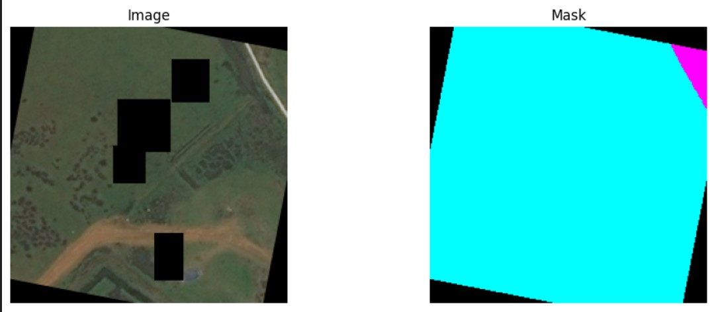
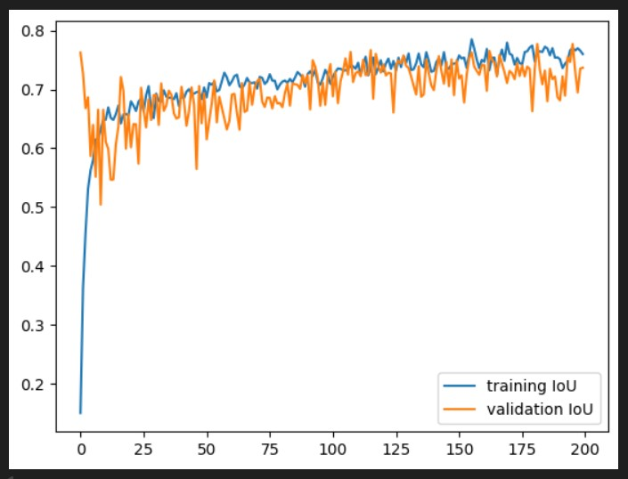

# DeepGlove-FFT-Attention-U-Net-for-DeepGlove-Image-Segmentation
A hybrid U-Net architecture that integrates frequency-domain features (via FFT) with attention mechanisms to improve DeepGlove image segmentation

This project implements a **U-Net architecture enhanced with FFT-based frequency features and attention mechanisms** to improve DeepGlove image segmentation accuracy.  
It demonstrates how combining **spatial and frequency-domain features** can lead to more precise segmentation results.  

---

## 🔑 Features
- FFT-based feature extraction for global frequency information.  
- Attention modules to refine spatial feature selection.  
- PyTorch implementation with training and evaluation pipelines.  
- IoU-based performance evaluation.  

---

## 🖼️ Sample Results

### 1. Sample Input and Segmentation
  
*Left: Original DeepGlove image, Right: Segmentation output by DeepGlove-FFT-Attention-U-Net*

### 2. IoU Performance Visualization
  
*Intersection-over-Union (IoU) score plot showing segmentation performance across validation images.*

---

